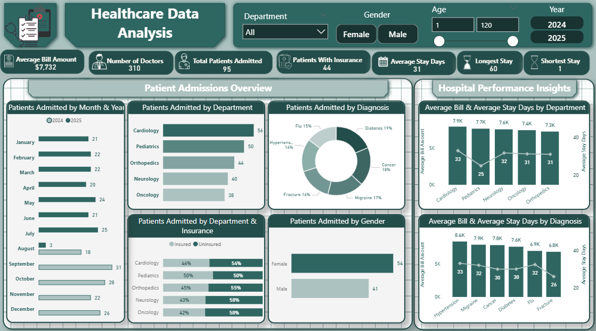

# 🏥 Healthcare Operations Dashboard

_This project is an interactive Power BI dashboard designed to provide hospital administrators with actionable 
insights into patient admissions, diagnoses, insurance coverage, and billing._

#### 📊 Key Features

- **KPIs:** Average bill amount, average stay days, longest/shortest stay, and total patients admitted.
- **Admissions Analysis:** By department, diagnosis, gender, and insurance type.
- **Trends & Insights:** Financial and operational patterns to identify high-cost departments and patient flow changes.
- **Interactivity:** Filters for time, department, gender, and insurance type to allow customized exploration.

#### 🎯 Purpose

_The dashboard supports healthcare leaders in making faster, data-driven decisions by improving:_

- Resource allocation
- Operational efficiency
- Financial transparency

#### 🛠 Tools & Skills Used

- Power BI for dashboard design and interactivity
- Data Cleaning & Modeling for accurate measures
- DAX for KPI calculations
- Data Visualization & Storytelling for clear insights

#### 📸 Dashboard Preview

